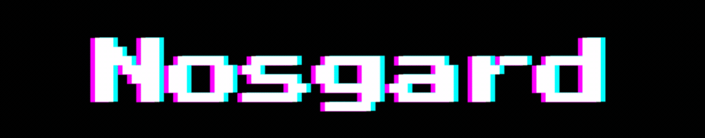

  

<h1>:wave:Hello Traveler!</h1>

I'm glad you found your way to my profile. You're probably wondering who I am and what I do. I'd like to tell you all about that below.

<h2>:page_facing_up:About Me</h2>

I'm Niklas, a <b>Junior Software Developer</b> with a strong passion for the development of interactive content. What really motivates me to get out of bed every day and start typing on my Keyboard is the fact that you can basically create anything you want, as long as you have the will to fight for your goal :muscle:

I have completed two vocational training programs. Thanks to my training, I not only gained a lot of theoretical knowledge about Software Development, but I was also involved in real-world projects right from the start. Right now I love Fullstack-Development, creating small tools, practicing new technologies and use them in my projects to gain experience.

<h2>:computer:Tech-Stack</h2>

<h3>Languages & Technologies</h3>

  
  
  
  
  
  
  
  
  
  
  
  
  
  
  
  

<h3>Dev-Setup</h3>

  
  
  
  
  

---

<h2>:mushroom: Side-Quests</h2>

I have a few things I do in my free time to find my inner balance

<ul>
  <li>:hammer: Building, Drawing and Playing Warhammer 40K</li>
  <li>:bowl_with_spoon: Cooking and Baking</li>
  <li>:runner: Doing Sports</li>
  <li>:video_game: Gaming</li>
</ul>

---

<h2>:email: Contact</h2>

I'm open to collaboration. You can expect a friendly, reliable and transparent mate for all of your project ideas.

Feel free to send me a message on <b>GitHub</b>. Looking forward to build awesome projects with you!

---

Thank you for visiting my profile and as always:

:desktop_computer:<b>Happy Coding!</b>:desktop_computer:

